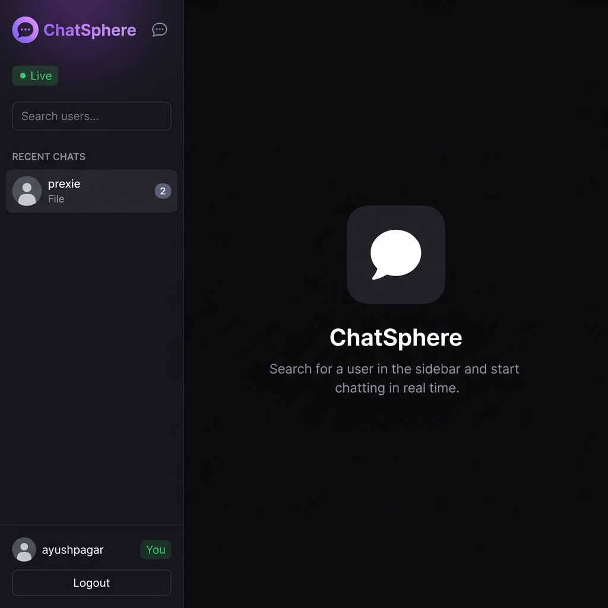
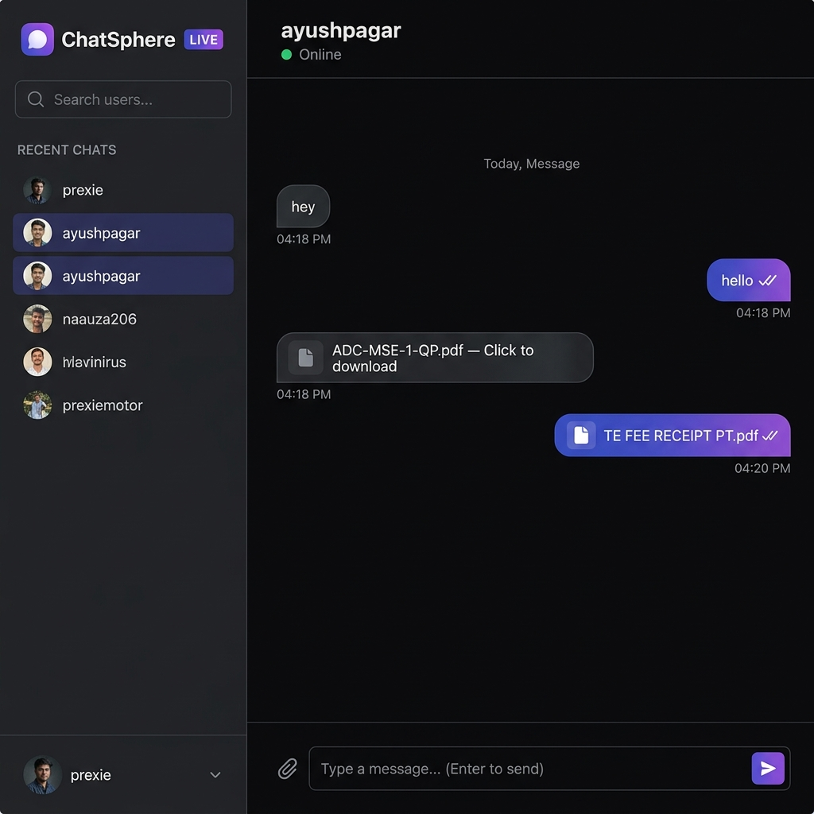
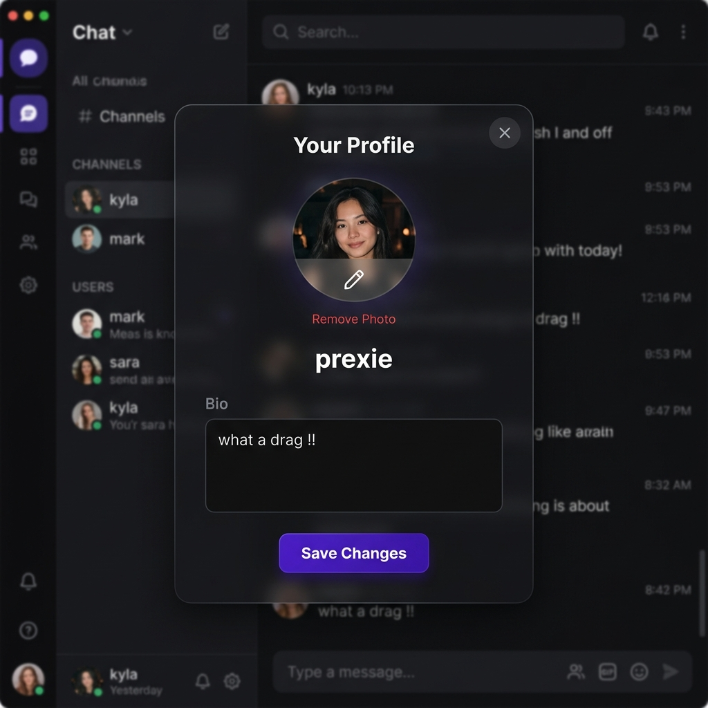
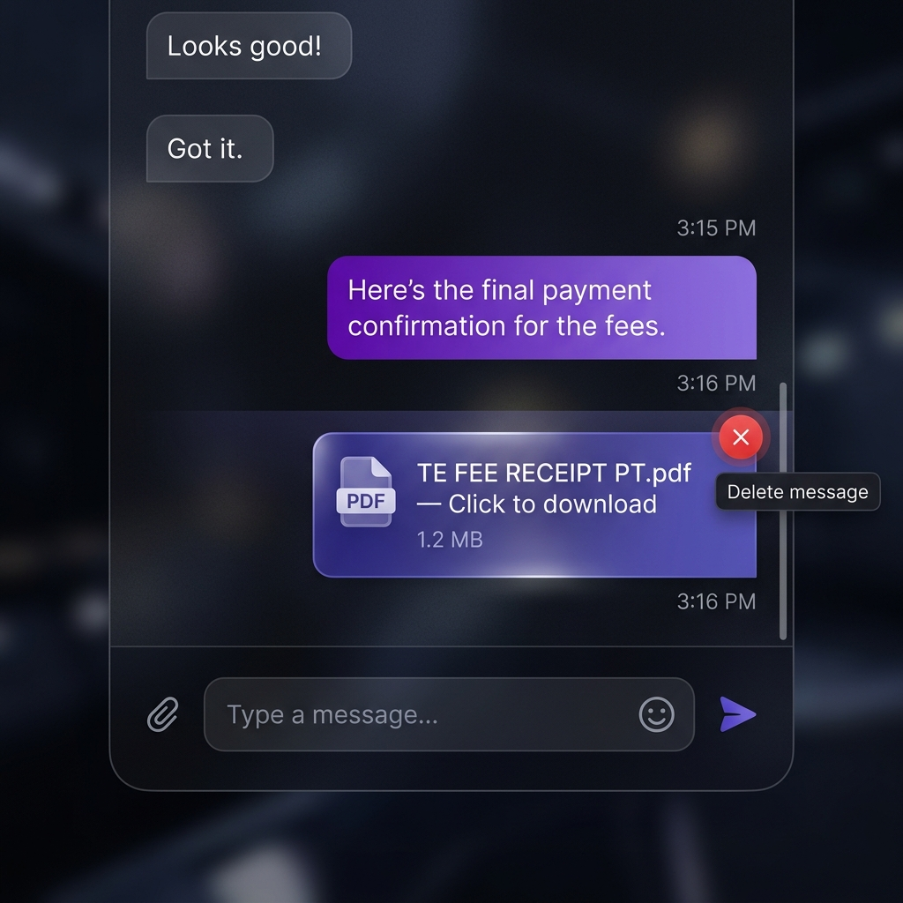

<div align="center">


# ChatSphere

**A production-grade, real-time chat application**

*Built with React 19 · Node.js · Socket.IO · MongoDB*

<br/>

[](https://chat-sphere-sable-sigma.vercel.app/chat)
[](https://nodejs.org)
[](https://react.dev)
[](https://socket.io)
[](https://mongodb.com)
[](LICENSE)

<br/>

[Features](#-features) · [Screenshots](#-screenshots) · [Tech Stack](#-tech-stack) · [Getting Started](#-getting-started) · [API Reference](#-api-reference) · [Deployment](#-deployment)

</div>

---

## ✨ Features

<table>
<tr>
<td width="50%">

🔐 **JWT Authentication**
Secure register & login with hashed passwords (bcrypt) and stateless token-based sessions

⚡ **Real-Time Messaging**
Instant delivery via Socket.IO WebSockets — no polling, no delays

🟢 **Online Presence**
Live online/offline indicators and "last seen" timestamps per user

✍️ **Typing Indicators**
See when the other person is composing a reply, in real time

</td>
<td width="50%">

✅ **Read Receipts**
Single ✓ for sent, double ✓✓ for delivered and read messages

📎 **File & Image Sharing**
Upload and share PDFs, images, and documents directly in chat

🔔 **Unread Badges**
Per-conversation unread counters always visible in the sidebar

🛡️ **Production Security**
Helmet, CORS validation, rate limiting, and input sanitization

</td>
</tr>
</table>

---

## 📸 Screenshots

### 🏠 Home — No Conversation Selected

> The sidebar shows your recent chats with unread counts. The main area guides you to pick a user and start chatting.



---

### 💬 Active Conversation — Messages & File Sharing

> Send text messages and attach files (PDFs, documents, images). Delivered messages show timestamps and ✓✓ read receipts.



---

### 👤 Profile Editor

> Click your avatar at the bottom of the sidebar to open the profile modal. Update your photo and bio without leaving the chat.



---

### 🗑️ Message Actions — Delete on Hover

> Hover any message you sent to reveal a delete button. Messages are soft-deleted and shown as removed to both parties.



---

## 🛠️ Tech Stack

### Backend
| Package | Version | Purpose |
|---|---|---|
| **express** | ^4.22 | REST API server |
| **socket.io** | ^4.8 | WebSocket real-time layer |
| **mongoose** | ^8.23 | MongoDB ODM |
| **jsonwebtoken** | ^9.0 | Auth token signing & verification |
| **bcryptjs** | ^2.4 | Password hashing |
| **helmet** | ^7.1 | Secure HTTP response headers |
| **express-rate-limit** | ^7.2 | API rate limiting |
| **express-validator** | ^7.0 | Input validation & sanitization |
| **multer** | ^2.1 | File / image upload handling |
| **winston** | ^3.13 | Application-level logging |
| **morgan** | ^1.10 | HTTP request logging |

### Frontend
| Package | Version | Purpose |
|---|---|---|
| **react** | ^19.2 | UI library |
| **vite** | ^8.0 | Build tool & dev server |
| **react-router-dom** | ^7.14 | Client-side routing |
| **socket.io-client** | ^4.8 | Real-time WebSocket connection |
| **axios** | ^1.15 | HTTP client for REST API |
| **react-hot-toast** | ^2.6 | Toast notifications |

---

## 📁 Project Structure

```
ChatSphere/
├── client/                      # ⚛️  React Frontend (Vite)
│   ├── src/
│   │   ├── components/
│   │   │   ├── auth/            # ProtectedRoute
│   │   │   ├── chat/            # ChatWindow, Sidebar, MessageBubble, MessageInput
│   │   │   ├── common/          # Shared UI components
│   │   │   └── profile/         # Profile modal
│   │   ├── context/
│   │   │   ├── AuthContext.jsx  # Auth state & actions
│   │   │   └── SocketContext.jsx# Socket.IO lifecycle
│   │   ├── hooks/               # Custom React hooks
│   │   ├── pages/               # LoginPage, RegisterPage, ChatPage
│   │   ├── services/            # Axios API service layer
│   │   └── utils/               # Helper functions
│   ├── .env.example
│   └── vite.config.js
│
├── src/                         # 🖥️  Express Backend (App Logic)
│   ├── config/
│   │   ├── db.js                # MongoDB connection
│   │   └── socket.js            # Socket.IO init & all event handlers
│   ├── controllers/             # Route handler functions
│   ├── middleware/
│   │   └── error.middleware.js
│   ├── models/
│   │   ├── user.model.js
│   │   ├── message.model.js
│   │   └── conversation.model.js
│   ├── routes/
│   │   ├── auth.routes.js
│   │   ├── message.routes.js
│   │   └── user.routes.js
│   ├── utils/logger.js          # Winston logger
│   └── app.js                   # Express app factory
│
├── server/server.js             # 🚀 Server entry point
├── docs/screenshots/            # 📸 App screenshots
├── uploads/                     # 📂 Uploaded files (gitignored)
└── package.json
```

---

## 🚀 Getting Started

### Prerequisites

- **Node.js** ≥ 18
- **npm** ≥ 9
- **MongoDB** — local or [MongoDB Atlas](https://www.mongodb.com/atlas)

### 1. Clone

```bash
git clone https://github.com/premthoke/ChatSphere.git
cd ChatSphere
```

### 2. Install All Dependencies

```bash
npm run install:all
```

> Installs both root (backend) and `client/` (frontend) packages in one step.

### 3. Configure Environment Variables

**Backend** (`/.env`):
```env
PORT=5000
NODE_ENV=development
MONGO_URI=mongodb://localhost:27017/chatsphere
JWT_SECRET=your_super_secret_key_min_64_chars
JWT_EXPIRES_IN=7d
CLIENT_URL=http://localhost:5173
CLIENT_ORIGIN=http://localhost:5173
BCRYPT_SALT_ROUNDS=12
RATE_LIMIT_WINDOW_MS=900000
RATE_LIMIT_MAX=100
```

**Frontend** (`/client/.env`) — copy from example:
```bash
cp client/.env.example client/.env
```
```env
# Development (Vite proxy handles /api automatically)
VITE_API_URL=/api

# Production
# VITE_API_URL=https://your-backend.onrender.com/api
# VITE_API_BASE=https://your-backend.onrender.com
# VITE_SOCKET_URL=https://your-backend.onrender.com
```

### 4. Run in Development

Open **two terminals**:

```bash
# Terminal 1 — Backend (http://localhost:5000)
npm run dev

# Terminal 2 — Frontend (http://localhost:5173)
cd client && npm run dev
```

The Vite dev server proxies all `/api` and Socket.IO traffic to the backend automatically.

---

## 📡 API Reference

All protected routes require the header: `Authorization: Bearer <token>`

### Auth — `/api/auth`

| Method | Endpoint | Description | Auth |
|---|---|---|---|
| `POST` | `/register` | Create a new account | ❌ |
| `POST` | `/login` | Sign in and get JWT | ❌ |
| `GET` | `/me` | Get current user info | ✅ |
| `POST` | `/logout` | Log out | ✅ |

### Messages — `/api/messages`

| Method | Endpoint | Description | Auth |
|---|---|---|---|
| `GET` | `/:userId` | Fetch message history with a user | ✅ |
| `POST` | `/send/:userId` | Send a text or file message | ✅ |
| `DELETE` | `/:messageId` | Soft-delete a message | ✅ |

### Users — `/api/users`

| Method | Endpoint | Description | Auth |
|---|---|---|---|
| `GET` | `/` | List all users | ✅ |
| `GET` | `/:userId` | Get a user's profile | ✅ |
| `PUT` | `/profile` | Update own profile / bio | ✅ |
| `POST` | `/avatar` | Upload profile picture | ✅ |

### Health Check

```
GET /api/health → { "status": "ok" }
```

---

## ⚡ Real-Time Socket Events

| Event | Direction | Description |
|---|---|---|
| `join_room` | Client → Server | Join a private 1-on-1 chat room |
| `typing` | Client → Server | Start typing indicator |
| `stop_typing` | Client → Server | Stop typing indicator |
| `mark_read` | Client → Server | Mark messages as read |
| `user_typing` | Server → Client | Another user started typing |
| `user_stopped_typing` | Server → Client | Another user stopped typing |
| `messages_read` | Server → Client | Your messages were read |
| `userOnline` | Server → All | A user came online |
| `userOffline` | Server → All | A user went offline (with lastSeen) |
| `conversationUpdated` | Server → Client | Sidebar conversation metadata changed |

---

## 🌐 Deployment

ChatSphere uses a split-deploy architecture:

| Layer | Platform | Config |
|---|---|---|
| Frontend | **Vercel** | `client/vercel.json` — rewrites all routes to `index.html` |
| Backend | **Render** | `npm start` — `NODE_ENV=production node server.js` |

### Deploy Backend → Render

1. Create a **Web Service**, connect your repo
2. Root Directory: `/`
3. Build Command: `npm install`
4. Start Command: `npm start`
5. Add all backend environment variables in the Render dashboard
6. Set `NODE_ENV=production`

### Deploy Frontend → Vercel

1. Import repo, set **Root Directory** to `client`
2. Framework Preset: **Vite**
3. Add environment variables:
   - `VITE_API_URL` → `https://your-render-app.onrender.com/api`
   - `VITE_API_BASE` → `https://your-render-app.onrender.com`
   - `VITE_SOCKET_URL` → `https://your-render-app.onrender.com`
4. Deploy — Vercel auto-runs `vite build`

---

## 📜 Available Scripts

### Root (Backend)

| Script | Description |
|---|---|
| `npm start` | Start production server |
| `npm run dev` | Start with nodemon (hot-reload) |
| `npm run build` | Build the React client |
| `npm run install:all` | Install all dependencies (root + client) |

### Client (Frontend)

| Script | Description |
|---|---|
| `npm run dev` | Start Vite dev server |
| `npm run build` | Production build |
| `npm run preview` | Preview the production build locally |
| `npm run lint` | Run ESLint |

---

## 🔒 Security

| Layer | Mechanism |
|---|---|
| **HTTP Headers** | Helmet.js sets secure headers on every response |
| **CORS** | Dynamic allowlist validation — only known origins accepted |
| **Rate Limiting** | 300 req / 15 min globally on all `/api` routes |
| **Authentication** | JWT required on all protected routes; verified per-request |
| **Input Validation** | `express-validator` sanitizes and validates all user input |
| **Passwords** | bcrypt with 12 salt rounds |
| **File Uploads** | Multer restricts file types and sizes |
| **Soft Deletes** | Deleted messages are flagged, never permanently erased |

---

## 🤝 Contributing

Contributions, issues, and feature requests are welcome!

1. **Fork** the repository
2. **Create** a feature branch: `git checkout -b feature/your-feature`
3. **Commit** your changes: `git commit -m 'feat: add your feature'`
4. **Push** to the branch: `git push origin feature/your-feature`
5. **Open** a Pull Request

---

## 📄 License

This project is licensed under the **MIT License** — see the [LICENSE](LICENSE) file for details.

---

<div align="center">

Made with ❤️ by **[Prem Thoke](https://github.com/premthoke)**

⭐ Star this repo if you found it useful!

</div>
